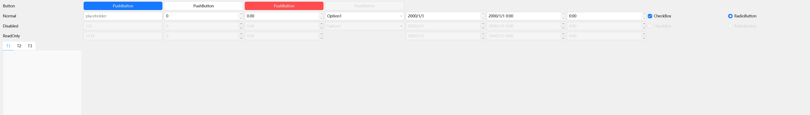

# EBuilderX-QT-STYLES
QT Widget styles like web

## set button style

```c++
ui->btnPrimary->setProperty("type", "primary");
ui->btnDefault->setProperty("type", "default");
ui->btnDanger->setProperty("type", "danger");
ui->btnDisabled->setProperty("type", "primary");
```


